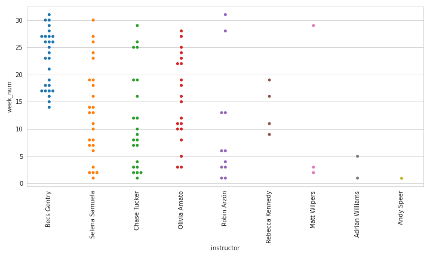

# Peloton Client Library

### Configuration

The library requires a configuration file, whos path is either pulled from the environment variale `PELOTON_CONFIG`,
or looked for in the hard-coded `~/.config/peloton` (which can be a symlink to a unified config if you have many). The
only config block that the library looks for is shown below.

```bash
[peloton]
username = Your_Peloton_Username_Or_Email
password = Your_Peloton_Password

# Optional: Whether or not to ignore warnings that are thrown (default: True)
ignore_warnings = True

# Optional: Verify SSL Authenticity (default: True)
ssl_verify = True

# Optional: Filepath to a local cert bundle. Useful when SSL MITM is in play (default: None)
ssl_cert = ''

```

You may also specify the environment variables `PELOTON_USERNAME` and `PELOTON_PASSWORD` which will take precedence over the config file.

### Example Usage

```python

>>> from peloton import PelotonWorkout
>>> workouts = PelotonWorkout.list()
>>> workout = workouts[0]

>>> dir(workout)
['_get_metrics', 'achievements', 'created', 'created_at', 'end_time', 'fitness_discipline', 'get', 'id', 'leaderboard_rank', 'list', 'metrics', 'ride', 'serialize', 'start_time', 'status', 'total_leaderboard_users']

>>> workout.status
'COMPLETE'

>>> workout.ride
<peloton.peloton.PelotonRide object at 0x104516e48>

>>> dir(workout.ride)
['description', 'duration', 'get', 'id', 'instructor_id', 'serialize', 'title']

>>> workout.ride.title
'45 min Max Capacity Ride'
```

### Seaborn Visualizations

#### Relational (`scatterplot`, `relplot`, `lineplot`)


#### Distributions (`histplot`, `displot`, `boxplot`, `violinplot`)




#### Categorical (`catplot`, `swarmplot`, `stripplot`, `countplot`)


#### Heatmaps / Time-series Data (`heatmap`)


